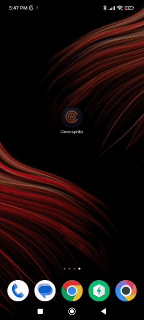
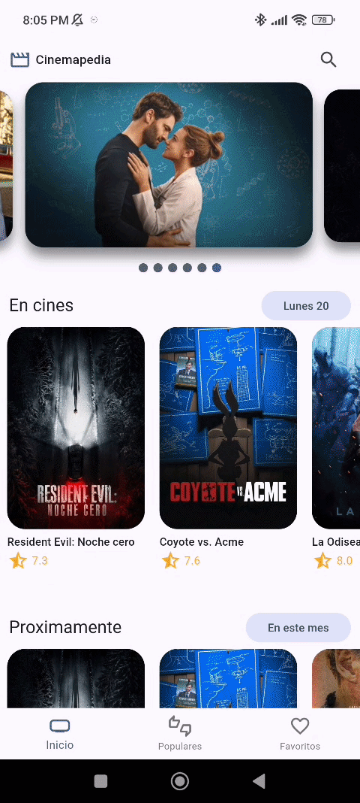
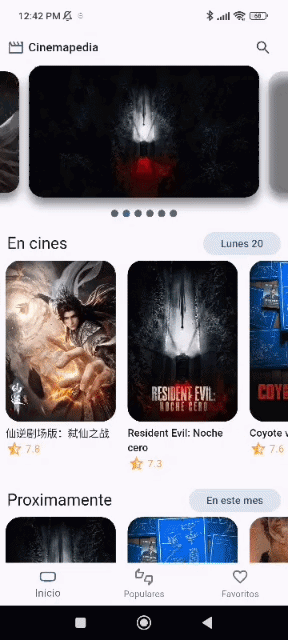

# 🎬 Cinemapedia - Tu Catálogo de Películas

¡Bienvenido a **Cinemapedia**! Una aplicación móvil desarrollada en **Flutter** para explorar, buscar y gestionar tus películas favoritas, diseñada desde cero aplicando los principios de **Clean Architecture**.

Los usuarios pueden visualizar las películas en cartelera, explorar las más populares, ver detalles de actores y guardar sus películas preferidas en una base de datos local para acceder a ellas sin conexión.

---

## 🧠 Arquitectura del Sistema

El proyecto sigue estrictamente el patrón de Clean Architecture para maximizar la escalabilidad, separando la lógica de negocio de la interfaz de usuario y aislando las dependencias externas:

<p align="center">
  
</p>

## 🛠️ Stack Tecnológico
- **Frontend:** Flutter, Material Design 3, Riverpod (Gestor de Estado), GoRouter.
- **Capa de Red:** Dio (Cliente HTTP) configurado para la TMDB API.
- **Capa Local:** Isar Database (Base de datos NoSQL para almacenamiento local).
- **Multimedia:** Youtube Player para visualización de trailers.

---

## 📸 Demostración del Sistema

1. ### Exploración y Cartelera en Tiempo Real

> Consumo eficiente de la API de The Movie Database (TMDB). Implementación de un "Infinite Scroll" gestionado a través de Riverpod, permitiendo al usuario explorar cientos de películas sin saturar la memoria del dispositivo.

### 2. Detalles de Película, Actores y Tráiler

> Navegación fluida usando GoRouter. Al entrar al detalle, la capa de infraestructura realiza peticiones concurrentes para obtener la película y el casting completo, transformando los JSON en entidades puras de Dart mediante Mappers.

### 3. Base de Datos Local y Favoritos

> Integración de Isar Database. Los usuarios pueden marcar películas como favoritas; estas se guardan de forma persistente y ultrarrápida en el dispositivo, permitiendo visualizar la lista incluso sin conexión a internet.

---

## ✨ Características Especiales (Developer Notes)
- 🏗️ **Clean Architecture Pura:** La capa de Dominio no tiene dependencias de Flutter ni librerías externas. La Presentación y los Datos se comunican exclusivamente a través de Contratos (Interfaces), protegiendo la lógica central.
- 🔄 **Mappers Inteligentes:** Uso del patrón Adapter/Mapper para transformar los modelos generados (Quicktype) que llegan de la API en Entidades de negocio, aislando la aplicación si el proveedor externo cambia su estructura.

---

## ⚙️ Instalación y Ejecución Local

**Prerrequisitos**
- Flutter SDK (v3.10+ recomendado) y Dart SDK.
- Android Studio / Xcode (Para emuladores).
- Una cuenta en [The Movie Database (TMDB)](https://www.themoviedb.org/) para obtener tu API Key.

**Pasos para ejecutar**

1. **Clonar el repositorio:**
   ```bash
   git clone [https://github.com/tu-usuario/cinemapedia.git](https://github.com/tu-usuario/cinemapedia.git)
   ```

2. **Obtener dependencias y autogenerar código:**
   Dentro del directorio del proyecto, descarga los paquetes e inicializa el generador de código para que Isar Database construya sus colecciones locales.
   ```bash
   cd cinemapedia
   flutter pub get
   flutter pub run build_runner build --delete-conflicting-outputs
   ```

3. **Configuración de Variables de Entorno y Credenciales:**
   
   * **TMDB API:**
     Crea un archivo llamado `.env` en la raíz del proyecto y verifica que las credenciales coincidan exactamente con tu llave de The Movie Database:
     ```properties
     THE_MOVIEDB_KEY=tu_api_key_aqui
     ```

4. **Levantar la Aplicación:**
   Abre una terminal en la raíz del proyecto, asegúrate de tener un emulador iniciado o un dispositivo físico conectado, y ejecuta:

   ```bash
   flutter run
   ```